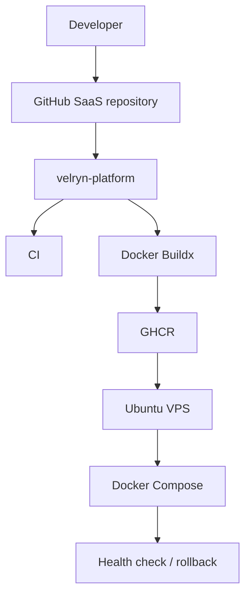

# Velryn Platform

Velryn Platform is the centralized, versioned CI/CD layer for Velryn SaaS products. A product repository keeps its application code, Dockerfile, Compose file, and secrets; a small workflow calls this repository for CI, image publishing, deployment, health checking, and rollback.

## Why it exists

Reusable workflows make SaaS number 15 as predictable as SaaS number 2. Workflow inputs are treated as a public API, images are built once, servers only pull prebuilt artifacts, and each app can target its own VPS using repository or environment secrets. No GitHub Organization feature is required.

## Quick start

1. Prepare a production `Dockerfile` and `docker-compose.yml` whose image uses `${IMAGE_TAG}`.
2. Prepare `/opt/velryn/<app>` on the VPS with the Compose file and runtime `.env`.
3. Add `VPS_HOST`, `VPS_USER`, `VPS_SSH_KEY`, and `VPS_KNOWN_HOSTS` to the SaaS repository.
4. Copy [the Next.js caller](examples/nextjs-caller.yml), replace `YOUR_GITHUB_USERNAME`, and commit it as `.github/workflows/deploy.yml`.
5. Push to `main`.

Production callers should use `@v1`, a release such as `@v1.0.0`, or an immutable commit SHA—never depend permanently on `@main`.

## What to call

| Need | Workflow |
| --- | --- |
| Node/Express CI | `ci-node.yml` |
| Next.js CI | `ci-nextjs.yml` |
| Python/Django/FastAPI CI | `ci-python.yml` |
| Image build/publish only | `docker-build.yml` |
| Deploy an existing tag | `deploy-vps.yml` |
| Build and deploy one image | `docker-deploy-vps.yml` |
| Build and deploy web/API/worker | `full-stack-deploy.yml` |

## Deployment and rollback

The default tag is `sha-<7-character-commit>`. The VPS keeps `deployment/current.env`, `previous.env`, and `metadata.json`. A failed Compose update or health check restores `previous.env` and starts the prior images. It never deletes volumes or reverses database migrations. See [Deployment](docs/DEPLOYMENT.md) and [Rollback](docs/ROLLBACK.md).

## Platform releases

Changes follow semantic versioning because input names and behavior are API contracts. Create `v1.0.0`, test it with a canary SaaS, then move the `v1` alias. See [Versioning](docs/VERSIONING.md).

## Documentation

- [Getting started](docs/GETTING_STARTED.md)
- [Adding a SaaS](docs/ADDING_NEW_SAAS.md)
- [Architecture](docs/ARCHITECTURE.md)
- [Workflow reference](docs/WORKFLOWS.md)
- [Secrets](docs/SECRETS.md)
- [Security](docs/SECURITY.md)
- [Troubleshooting](docs/TROUBLESHOOTING.md)
- [Contributing](CONTRIBUTING.md)

The current target is deliberately modest: GitHub Actions, GHCR, Ubuntu, SSH, Docker, Docker Compose, and Nginx. Kubernetes-scale machinery is outside v1.
